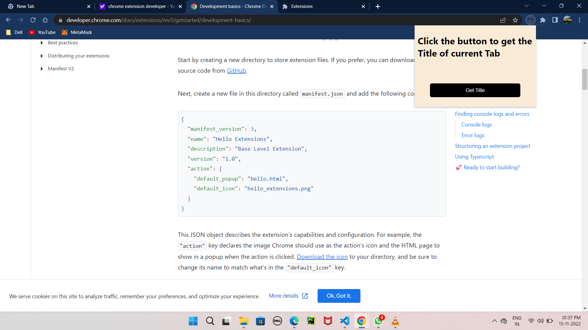

## Table of contents

- [Overview](#overview)
  - [The challenge](#the-challenge)
  - [Screenshot](#screenshot)
- [My process](#my-process)
  - [Built with](#built-with)
  - [What I learned](#what-i-learned)
  - [Useful resources](#useful-resources)
- [Author](#author)
- [Acknowledgments](#acknowledgments)


## Overview
- Google Chrome Extension

### The challenge

- Create a chrome extension with a button in the pop up.
- When the button is clicked the Extension should automatically pickup the title of the current tab and show it in the pop up itself.

### Screenshot
Screenshots of how my extension popup looks:



## My process

### Built with

- Semantic HTML5 markup
- CSS custom properties
- manifest.json
- javascript

### What I learned

In this project i learnt to make Google chrome extension and learnt about manifest.json configuration.

A code snippet of how i achieved the information of current opened tabs in browser window through Javascript:

```js
// defining current_tab_title() func which will get the tab title and add it to the DOM.

const current_tab_title = () => {

    chrome.tabs.query({active: true, currentWindow: true}, (tabs) => {
        // this query checks Whether the tabs are active in their windows and also in the current window.
        // then it requires a callback func. in which tabs parameter is to be passed.
        var activeTab = tabs[0];
        const title = document.querySelector("#get-title");
        title.innerHTML = `<h2>Title of current Tab is :</h2> <h3>${activeTab.title}</h3>` ;
     });
}

button.addEventListener('click', current_tab_title); // when button is clicked, current_tab_title() func. is called
```


### Useful resources

- [Chrome Extension Developers](https://developer.chrome.com/docs/extensions/) - This is the official documentaion having everything to get started to create your extension.
- [Development basics](https://developer.chrome.com/docs/extensions/mv3/getstarted/development-basics/) - Here you will get idea of how to add your extension directory, creating manifest.json file, default_popup, etc.
- [Manifest.json](https://developer.chrome.com/docs/extensions/mv3/intro/mv3-overview/) - All about manifest.json version 3.
- [All about chrome.tabs.query(object queryInfo, function callback)](https://sunnyzhou-1024.github.io/chrome-extension-docs/extensions/tabs.html#method-query)

## Author

- Gautam Kumar [Github profile](https://github.com/Gautambudh)

## Acknowledgments

Thapa technical is a youtube channel which helped me lot in learning about the chrome extension development. A big thanks to him.


